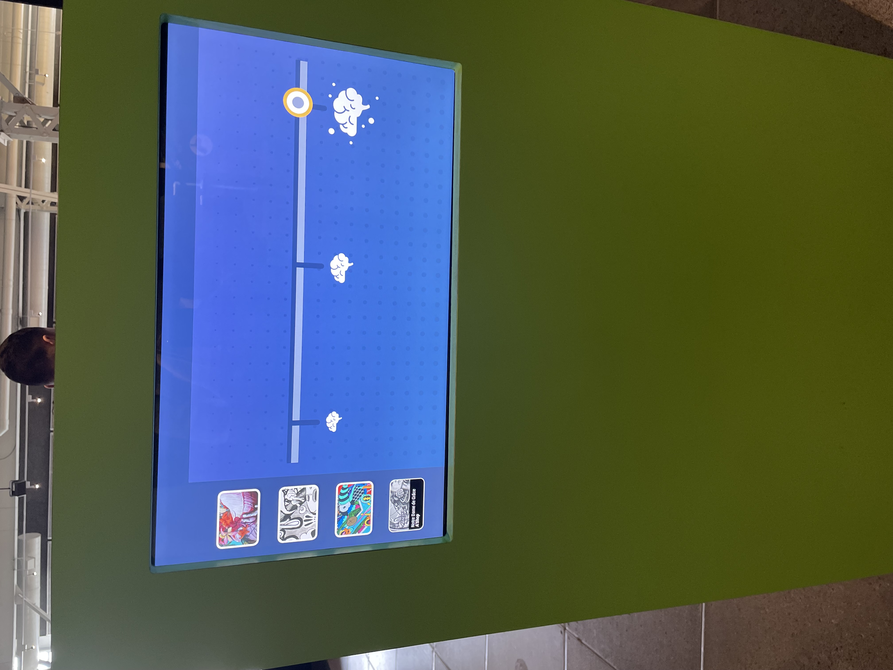
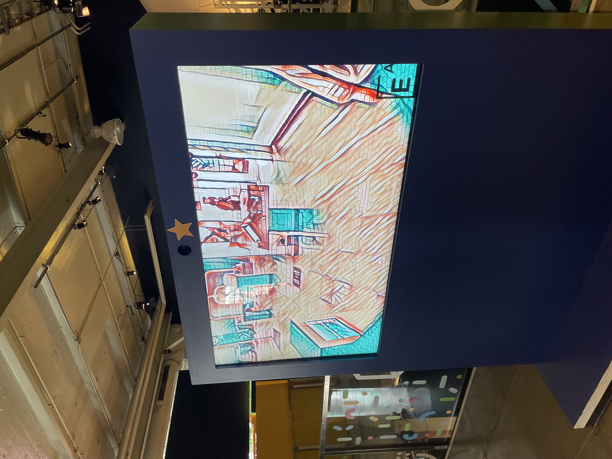
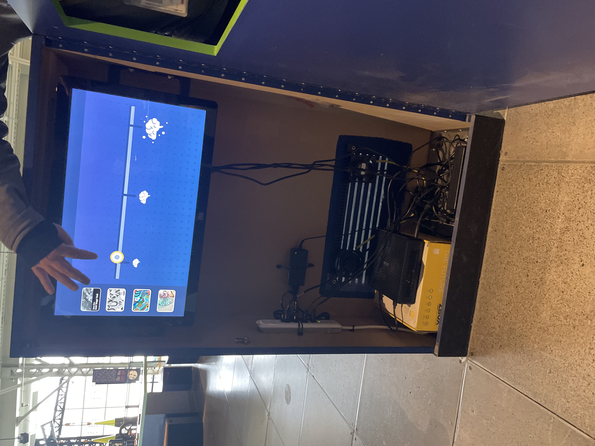

# Visite en groupe au Centre des sciences de Montréal

## Ecrant inteligence artificiel

## Introduction
Malheureusement, durant notre sortie lors du 10 avril 2024 au Centre des sciences de Montréal, je n'ai pas eu la chane d'identifier le nom de l'oeuvre que je souhaite presenter ainsi du nom de l'artiste. Cependant, l'oeuvre que je desire presenter cest un ecrant tactile qui utilise l'inteligense artificiel pour les projeter sur au autre ecrant. 

## Description
L'oeuvre AI consite de deux ecrants, un petit ecrant tactile avec 4 mode de filtre artificiel ou tu peut controler controler l'intensite avec une glissiere. Le niveau d'intensite s'illustre avec un petit cerveau jusqu'a un grand cerveau, plus grand le cerveau plus grande sera l'intensite des filtres et vise versa.

Le premier mode s'appelle "Sans titre" par David Meggs Hook ou les couleurs afficher sur le grand ecrant de visionnement sons plus ou moin distortees et saturer plus vers la couleur rouge.

Le deuxieme mode s'appelle "Quai des Arts" par En Masse ou les couleurs sont noir et blancs et donne un effet d'arbre mort a tout l'entourgage quelle captive.

Le troiseme mode j'ai pas eu la chance d'avaoir une photo/video claire sur celui la, mais les couleurs son bleu truquoise et beige avec une texture de bois et de roche.

Le quatrieme mode  j'ai pas eu la chance d'avaoir une photo/video claire sur celui la non plus, mais les couleurs son rose.

Le deuxieme ecrant sert a disposer les changement fait sur l'ecrant tactile.

## Type d'instalation
Cet oeuvre a une type d'instalation intéractive, comme mentionner précédament les visiteures peuvent intéragires avec l'écrant tactile pour tester les différents type de filte d,intéligense artificiel.

## Mise en espace
La mise en espace est simple, cette oeuvre consiste de simplement deux écrants. L'écrant principale est seulement une projection qui varie selon les modification que fait le visiteur sur l`écrant tactile. L'écrant principal est positionner contre un mur et l'écrant tactile est positionner a ca gauche a un angle de 45 degrée.

## Composantes et techniques
À l'oeil je n'arrive pas a identifier chaqu'une des composantes techniques. 

### Voici l'intérieur de l'écrant tactile

## Éléments nécessaires à la mise en exposition

## Apreciation

## Aspect que vous ne souhaiteriez pas retenir
