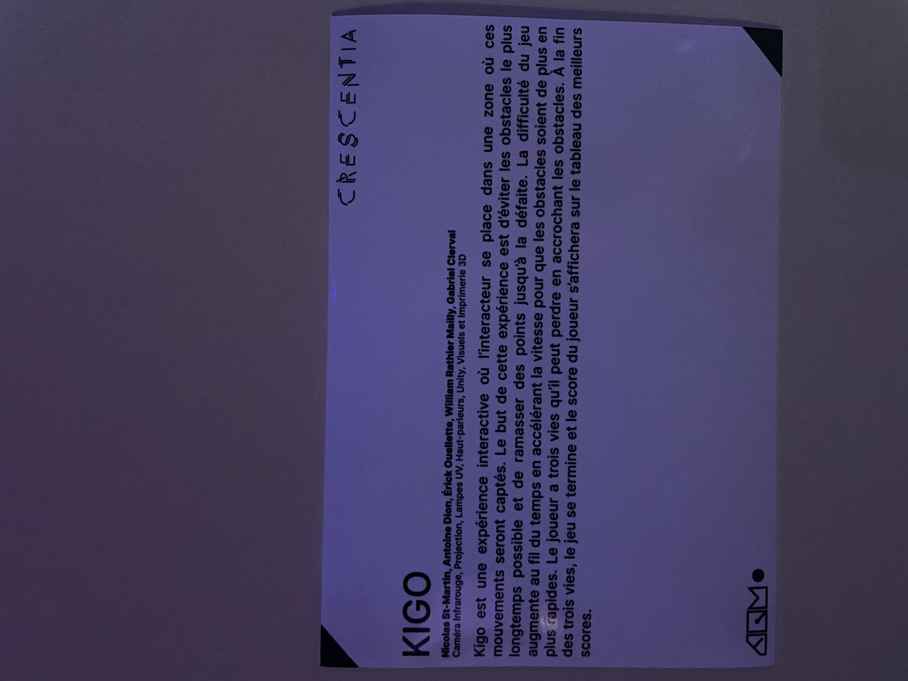
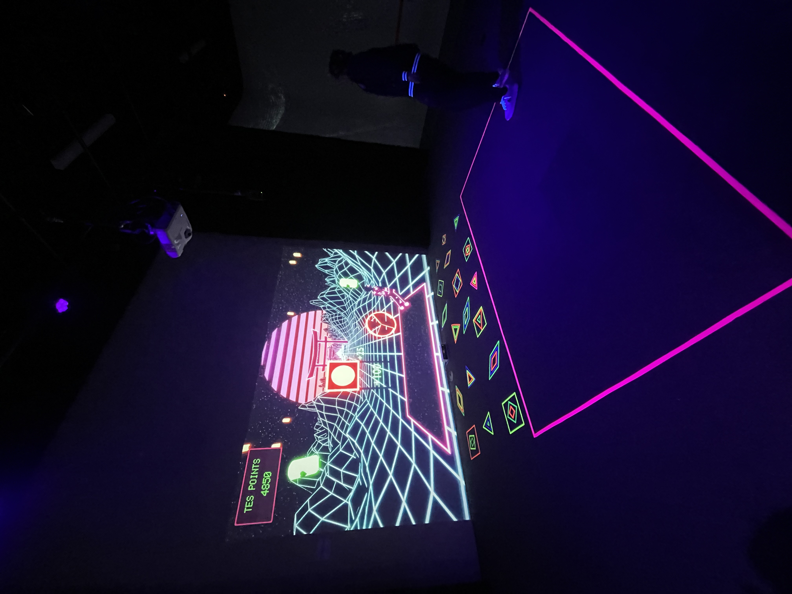
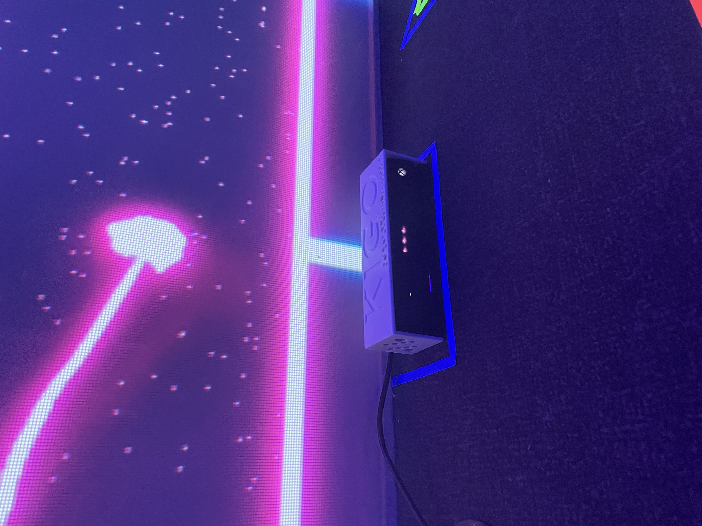
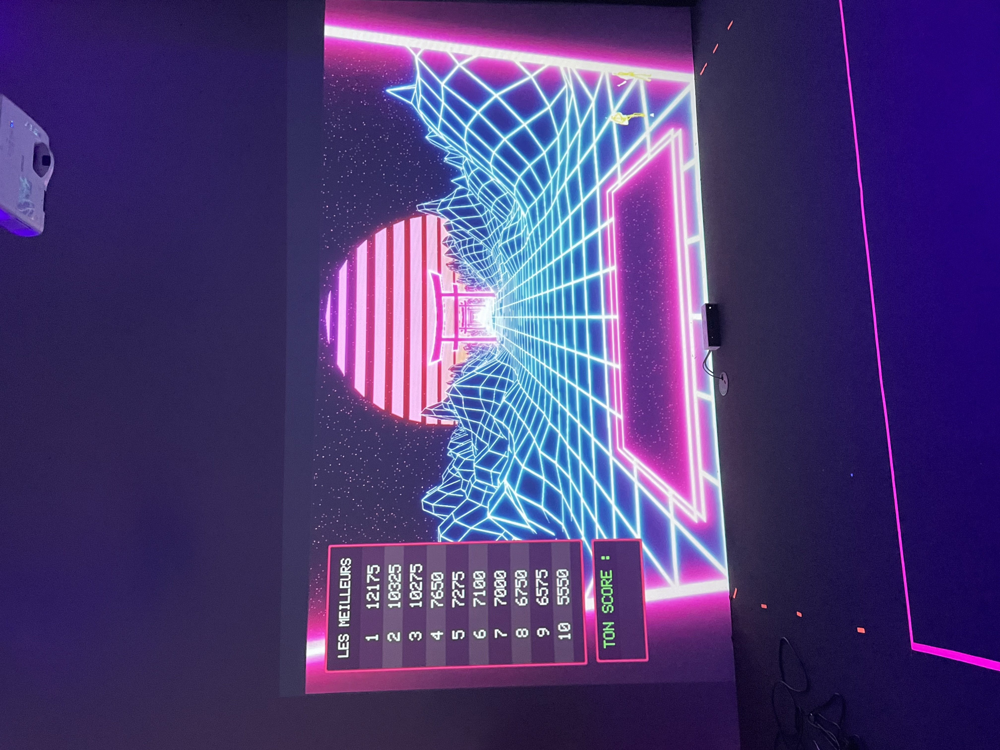

# Mon avis sur cette expérience

## Fiche Oeuvre: Crescentia creations finissants 

## Kigo

### Créateurs

Érick Ouellette

William Rathier Mailly

Gabriel Clerval

Nicolas St-Martin

Antoine Dion

## Introduction
Titre de l'oeuvre: Kigo

Année de réalisation: 2024

Type d'exposition: temporaire

Date de visite: 21 février

Lieu de l'exposition: grand studio

## Description 
Kigo est le nom de l'exposition que je désir décrire, c'est mon oeuvre préférer parmis les 5 oeuvres présenter par les éleves d'intégration multimédia pour les création des finissants du projet Crescenta. Kigo est projet multimédia interactif où tu dois éviter des obstacles qui se rapprochent de toi. Tu te déplaces en utilisant des mouvements captés par un projecteur hitbox. Le jeu a un style rétro futuriste avec des obstacles sur une route et un paysage sur les côtés. Chaque niveau représente une saison différente avec une musique adaptée. L'objectif est de terminer les niveaux de plus en plus difficiles pour ressentir de l'engagement et de la détermination. Kigo a un type d'instalation interactive elle utilise des capteurs, qui mesurent des événements tels que le mouvement, qui est un élément essentielle a l'oeuvre vu que le projecteur hitbox capte les mouvements du visiteurs pour démontrer le personnage dans l'écrant. Le visiteur pour bouger, s’accroupir, toucher et interagir afin d'avoir une meilleur expérence au jeux. Bref, Kigo est un jeux ou le visiteur a 3 vies et doit aquérir le plus de points possible sans ce faire toucher par les obstacles, plus ou le jeux avance plus il sera difficile d'aquérir des points ainsi d'éviter les obstacles vu que la vitesse augmentera. 

## Analyse 
L'élément fort de l'exposition Kigo c'est le projecteur hitbox ce qui affichage l'interactif utilisé pour créer des expériences de jeu immersives en projetant des images sur une surface et en permettant aux joueurs d'interagir directement avec elles. Dans ce cas elle détect les mouvements du visiteurs. 

### Voici le schéma de l'installation prévue qui comprend la mise en espace (Plan technique)

### Composantes et techniques (Éléments nécessaires à la mise en exposition)

#### Audio

- 1 Console de sons

- 1 Carte de sons

- 2 Haut-parleurs Genelec 8010APM

- 4 Câbles XLR (M->F) (Longueur minimale estimée entre 4-6 mètres)

#### Vidéo

- 1 Projecteur

- 1 Kinect V2

- 1 sytème d'acrochage pour le projecteur

#### Électricité

- 2 Cordon IEC (pour alimenter les haut-parleurs)

- 2 Multiprise

- 2 Extensions de fils électrique (Longueur minimale estimée entre 6-8 mètres)

- 1 Câble d’alimentation pour ordinateur

- 1 Câble d’alimentation pour console de son

#### Réseau

- 2 Fils Ethernet (longueur minimale estimée entre 4-8 mètres)

- 1 HDMI Extender

- 2 Câbles HDMI

- Câble displayPort

#### Ordinateur

- 1 Chariot Ordinateur

#### Autres

- Tapis de protection

- 3 Safety en métal

- 1 Powercon

- 1 Magic Arm

Source: https://tim-montmorency.com/2024/projets/Kigo/docs/web/preproduction.html

## Apréciation

