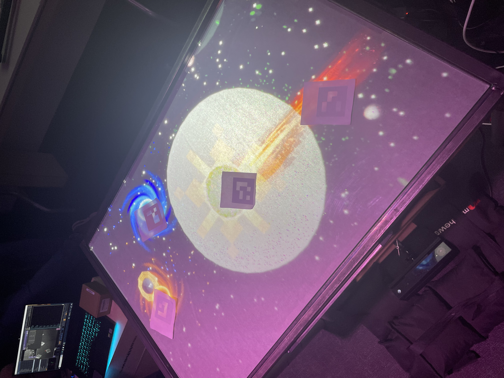
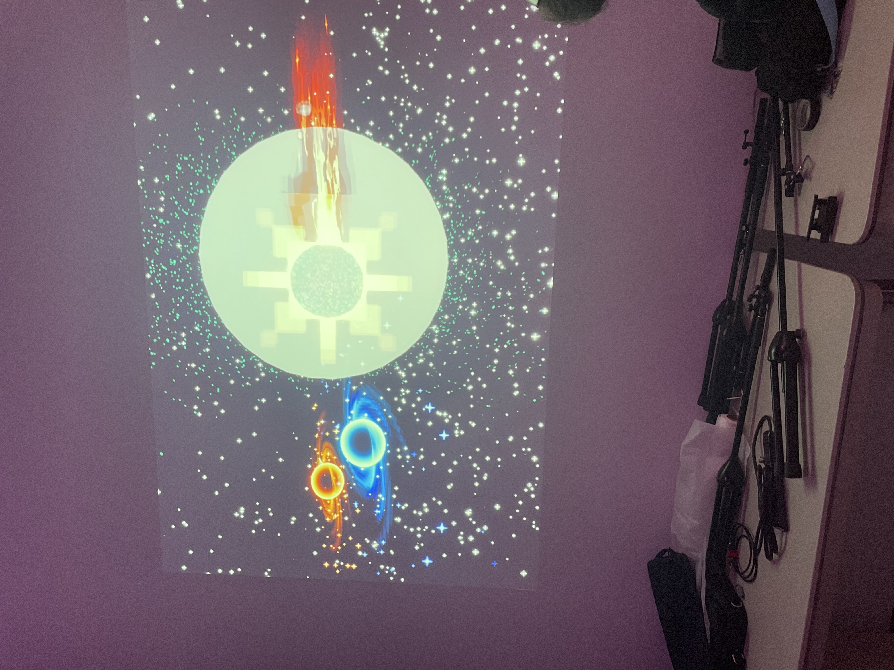
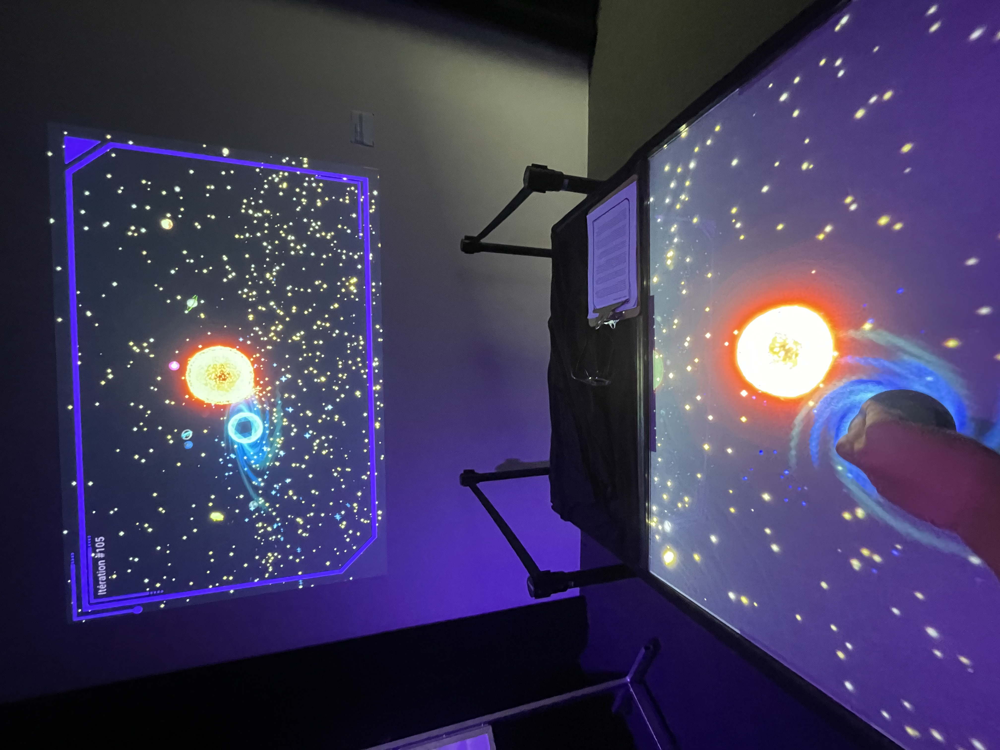
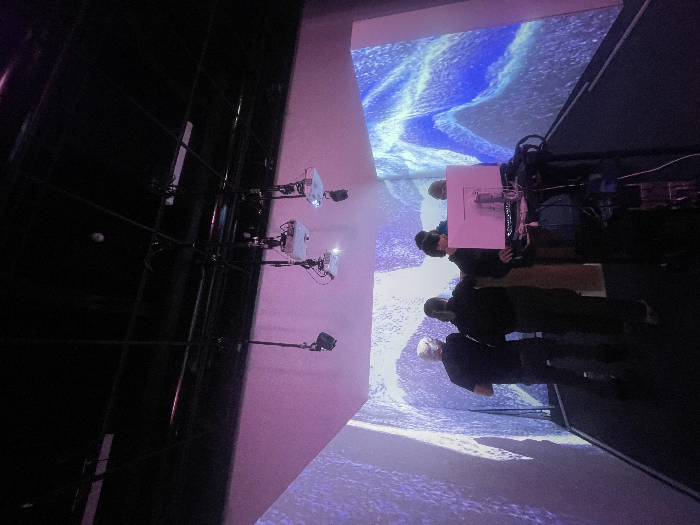
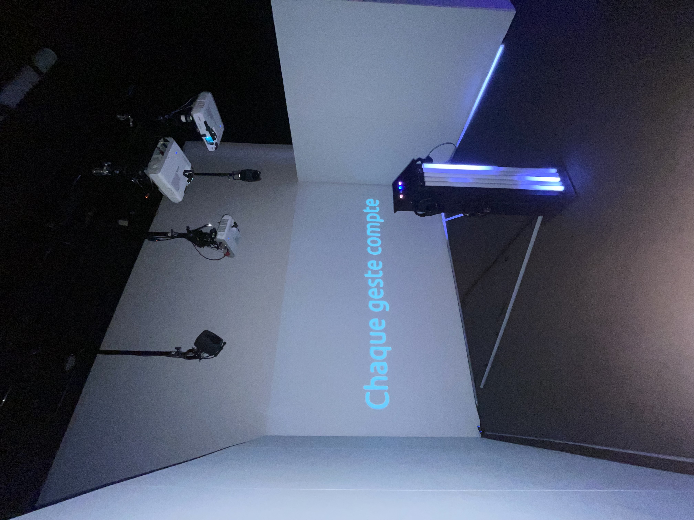
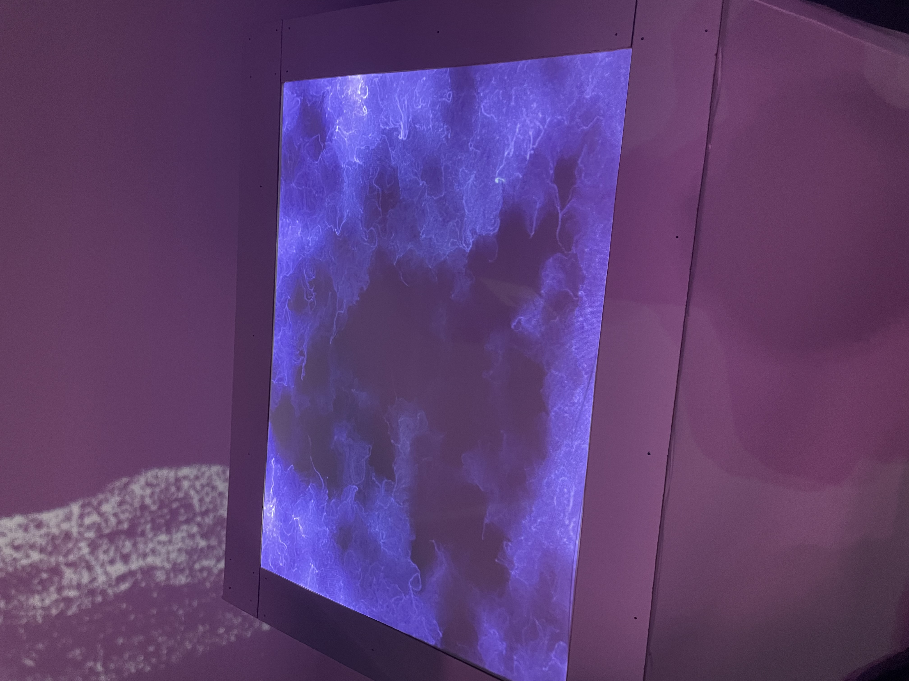
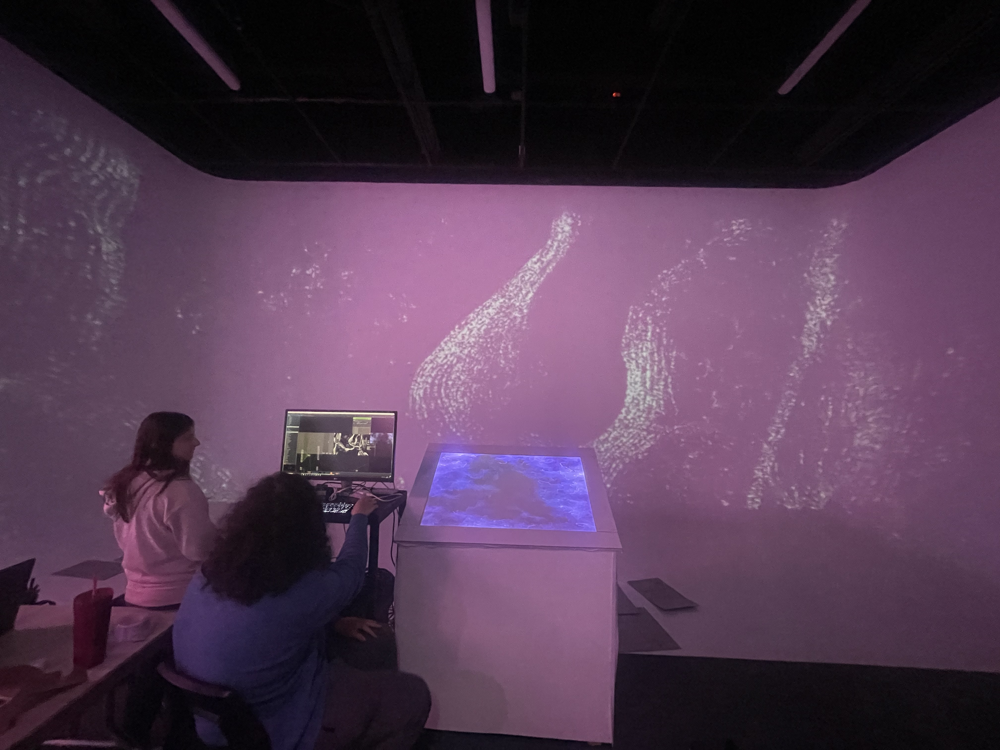
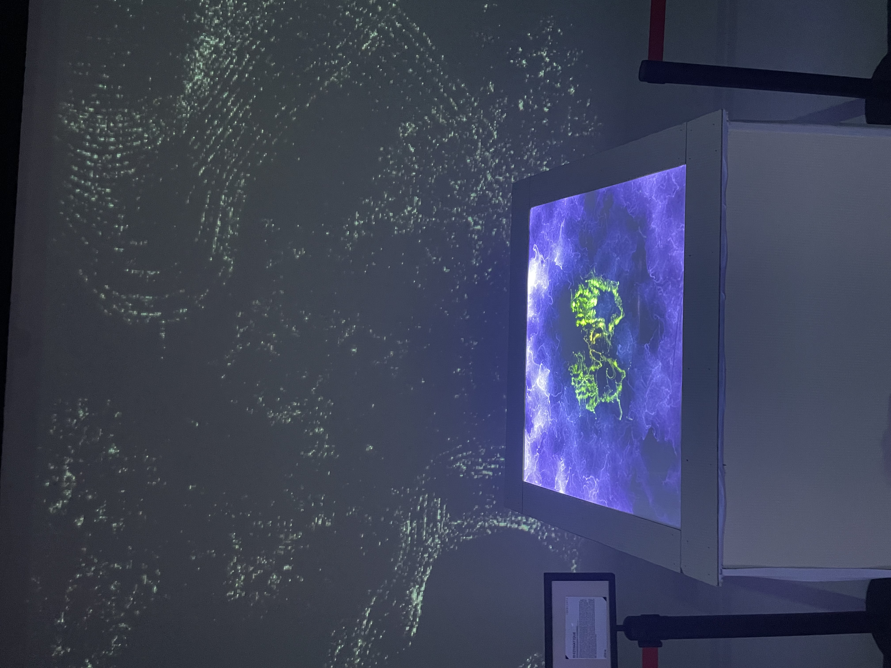

# Un résumé sur l'exposition Crescentia

## Fiche Sommaire: Crescentia

## Introduction
Crescentia c'est le nom de l'exposition finale des étudiants en techniques d'intégration multimédia du Collège Montmorency 2024, la présentation des oeuvres temporaires sont situer au grand et petit studio. Ce sont des créations en mouvement continue, qui évoluent et se transforment selon les actions des visiteurs.
Crescentia, veut aussi « croissance » en latin, ce qui explique le choix du nom de cette exposition a propos du concept d'évolution. L'exposition comporte 5 oeuvres, Rhizomatique, Effet-Papillon, Kigo, Sonalux et Canevas Cosmique.

## Description
### Canevas cosmique
Premièrement, Canevas cosmique est une oeuvre ou le visiteur devra y intéragire en déplaçant une statuette sur une table qui fera bouger une certaine planette dans le système solaire projecter sur un ecrant au mur face du cyclorama du grand studio. En utilisent des projecteurs, du code (avec animation), etc, l'utilisateur poura intéragire avec les statues déclancheant différents phénomènes au system solaire projecté sur l'écrant.

### Voici l'instalation de la table en cours 
 

### Voici l'instalation de la projection en cours 

### Voici l'oeuvre Canevas cosmique completée

### Voici le schéma de l'installation prévue (Plan technique)

Source: https://tim-montmorency.com/2024/projets/Canevas-Cosmique/docs/web/preproduction.html

### Sonalux
Deuxièmement, Sonalux est une oeuvre ou le visiteur devra posé des gestes pour contrôler un environnement visuel et sonore évolutif ce qui les amènent vers un tout nouvel univers qui leur est propre. Celle si leurs donne une expérience en explorant les diverses composantes de la boîte ainsi que ses différentes scènes visuelles. Celle si est situer au mur en face de la porte d'entrée.

### Voici l'instalation en cours

### Voici l'oeuvre completée

### Voici le schéma de l'installation prévue (Plan technique)

Source: https://tim-montmorency.com/2024/projets/Sonalux/docs/web/preproduction.html

### Rhizomatique
Troisèmement, Rhizomatique est une oeuvre ou le visiteur devra intéragire avec la toile, celle-si donnera le sentiment d'une navigation dans le cerveau qui découvre tes souvenirs en projectant des projections immersives. Lorsque l'intéraction prend fin, la projection sur les murs va reprendre son état initale jusqu'à la prochaine intéraction. Plus qu'il y aura de l'intéraction avec la toile plus les projections seront claires. Cette oeuvre est située au cyclorama.

### Voici l'instalation en cours de la toile

### Voici l'instalation en cours des projections immersives

### Voici l'oeuvre completée

### Voici le schéma de l'installation prévue (Plan technique)

Source:https://tim-montmorency.com/2024/projets/Rhizomatique/docs/web/preproduction.html

## Analyse

## Expérience vécu

