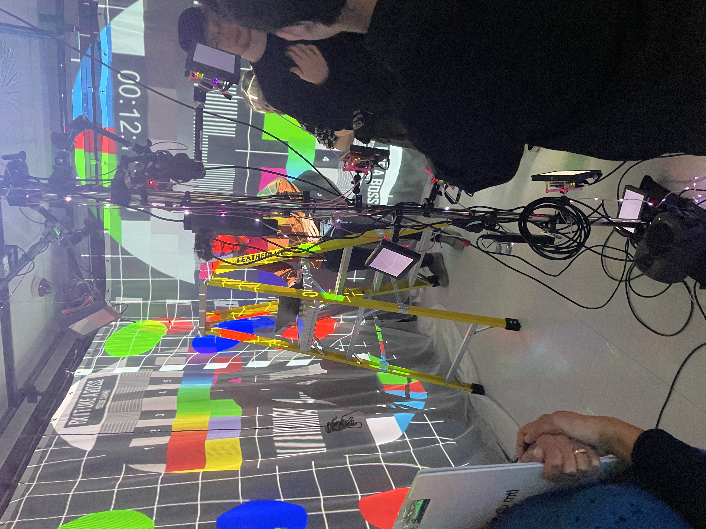
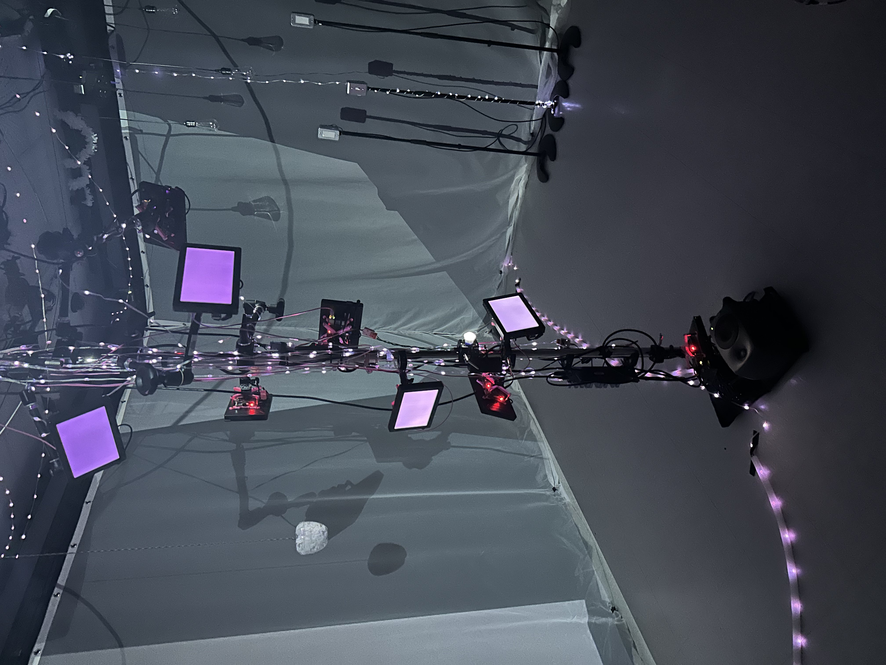
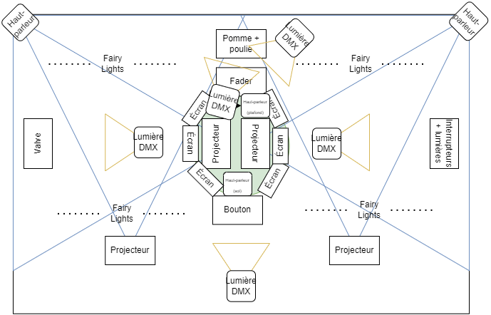

# Un résumé sur l'exposition Crescentia

## Fiche Sommaire: Crescentia

## Introduction
Crescentia c'est le nom de l'exposition finale des étudiants en techniques d'intégration multimédia du Collège Montmorency 2024, la présentation des oeuvres temporaires sont situer au grand et petit studio. Ce sont des créations en mouvement continue, qui évoluent et se transforment selon les actions des visiteurs.
Crescentia, veut aussi « croissance » en latin, ce qui explique le choix du nom de cette exposition a propos du concept d'évolution. L'exposition comporte 5 oeuvres, Rhizomatique, Effet-Papillon, Kigo, Sonalux et Canevas Cosmique.

## Description

## Canevas cosmique
### Créateurs

Jacob Alarie-Brousseau

Étienne Charron

Jérémy Cholette

Quoc Huy Do

Mikaël Tourangeau

Premièrement, Canevas cosmique est une oeuvre ou le visiteur devra y intéragire en déplaçant une statuette sur une table qui fera bouger une certaine planette dans le système solaire projecter sur un ecrant au mur face du cyclorama du grand studio. En utilisent des projecteurs, du code (avec animation), etc, l'utilisateur poura intéragire avec les statues déclancheant différents phénomènes au system solaire projecté sur l'écrant.

### Voici l'instalation de la table en cours 
 

### Voici l'instalation de la projection en cours 

### Voici l'oeuvre Canevas cosmique completée

### Voici le schéma de l'installation prévue (Plan technique)

Source: https://tim-montmorency.com/2024/projets/Canevas-Cosmique/docs/web/preproduction.html

## Sonalux
### Créateurs

Antoine Haddad

Camélie Laprise

Ghita Alaoui 

Vincent Desjardins

Deuxièmement, Sonalux est une oeuvre ou le visiteur devra posé des gestes pour contrôler un environnement visuel et sonore évolutif ce qui les amènent vers un tout nouvel univers qui leur est propre. Celle si leurs donne une expérience en explorant les diverses composantes de la boîte ainsi que ses différentes scènes visuelles. Celle si est situer au mur en face de la porte d'entrée.

### Voici l'instalation en cours

### Voici l'oeuvre completée

### Voici le schéma de l'installation prévue (Plan technique)

Source: https://tim-montmorency.com/2024/projets/Sonalux/docs/web/preproduction.html

## Rhizomatique
### Créateurs

Jolyanne Desjardins

MaÏka Désy

Laurie Houde

Felix Testa Radovanovic

Troisèmement, Rhizomatique est une oeuvre ou le visiteur devra intéragire avec la toile, celle-si donnera le sentiment d'une navigation dans le cerveau qui découvre tes souvenirs en projectant des projections immersives. Lorsque l'intéraction prend fin, la projection sur les murs va reprendre son état initale jusqu'à la prochaine intéraction. Plus qu'il y aura de l'intéraction avec la toile plus les projections seront claires. Cette oeuvre est située au cyclorama.

### Voici l'instalation en cours de la toile

### Voici l'instalation en cours des projections immersives

### Voici l'oeuvre completée

### Voici le schéma de l'installation prévue (Plan technique)

Source: https://tim-montmorency.com/2024/projets/Rhizomatique/docs/web/preproduction.html

## Effet Papillon
### Créateurs

Raphaël Dumont

Alexis Bolduc

William Morel

Alexia (Ryan) Papanikolaou

Viktor Zhuravlev

Jasmine Lapierre

Quatrièmement, Effet Papillon est une oeuvre ou le visiteur devra intéragire avec multiples éléments techniques pour recréer un cycle de vie d'un pommier. Celle-si met en lumière l'effet papillon à travers des éléments électroniques, comme les étapes pour donner une expériense au visiteur a propos de cette oeuvre. L'effet papillon c'est de petites actions peuvent déclencher des conséquences imprévisibles à long terme. Le son et les éléments visuels donne une expérience plus réel au visiteurs 

### Voici l'instalation en cours 

### Voici l'oeuvre completée

### Voici le schéma de l'installation prévue (Plan technique)

Source: https://github.com/Iteration6/Effet-Papillon/blob/2b2e73f72208211f2ff77f123d528beb9cf9ef03/docs/preproduction/medias/plantation.drawio.png

## Analyse
Pour chaqu'une de ces oeuvres comportent leurs composantes essentielles ce qui les rends uniques de l'une des autres. Les trois cours fondamentals pour  avoir les compétences pour créer et réaliser ce genre projet sont tous les cours de web, la modélisation 3D et interactivité ludique. Le web est très important dans les cours de multimédias et pour le projet de Crescentia car c'est dans ce cours ou on apprend a coder, tous les oeuvres multimédia contiennent du code. L'interactivité ludique c'est la manière dont un ordinateur, un programme ou un contenu répond aux actions des personnes qui les utilisent. Tout les oeuvres présentés par les éleves du programe TIM utilisent la matière de ce cours pour donner au visiteur le choix d'intéragir avec leurs oeuvres. La modélisation 3D c'est le processus de création d'objets 3D à l'aide d'une application spécialisée, tout les oeuvres utilise le 3d qui donne l'effet visuel pour créer des scènes complètes d'images fixes ou d'animation a leurs oeuvres. 

L'Effet Pappillon utilise les speakers pour donner une expérience aux visiteurs plus réel lorqu'ils intéragisent avec les composantes mécanique de l'oeuvre. Par exemple, le son de fond qui donne une ambiance calme et douce ainsi des effects sonnores qui entrelace les intéragisements au son.

## Expérience vécu

