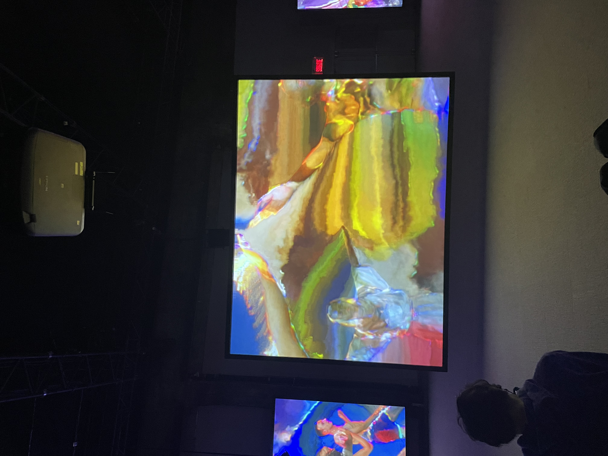

# Mon avis sur cette expérience

## Fiche d'oeuvre: Jeremy Shaw; Phase Shifting Index
Phase Shifting Index

## Introduction
Le Musée d’art contemporain de Montréal présente Phase Shifting Index situer Fonderie Darling, une œuvre de l’artiste Jeremy Shaw, né à Vancouver. Le Phase Shifting Index est une exposition temporaire intérieur. La date de la visite etait le 31 janvier 2024.

## Description
Une vaste installation vidéo immersive sur sept écrans affichent se faire reconnaître pour vrai des images d’archives de divers groupes de thérapie par le mouvement des années 60 aux années 90. les formats, film 16 mm au VHS en passant par le Hi-8 ont été utiliser pour l'oeuvre. 

## Création 
Phase Shifting Index concu par Jeremy Shaw en 2020, l'exposition de montreal a lieu jusqu'au 25 février 2024. Les mouvements de types rituels exécutés dans les séquences diffusées sur des écrans indépendants depuis une plateforme surélevée, évoquent des cultures uniques dont les systèmes de croyances sont fondés sur l’idée d’induire des réalités parallèles par le mouvement. Soucre:https://macm.org 

