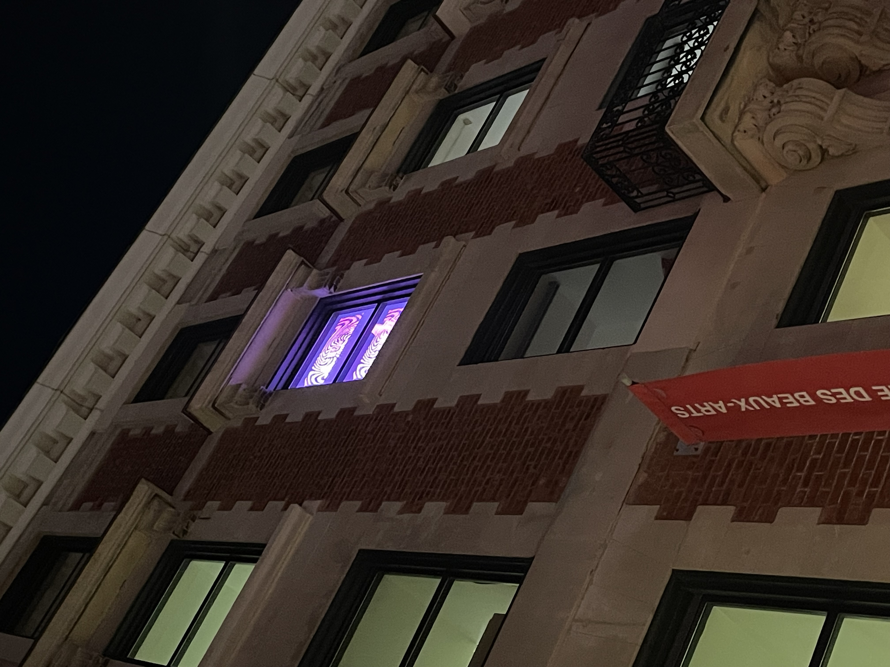

# Visite individuel

##  Musée des beaux-arts

## Description
- Pixels, petits points et monument
- presentée par Nathalie Bujold Montréal
- Du 11 septembre 2023 au 31 mars 2024,
- oeuvre temporaire
- durée de l'exposition: illumine tous les soirs jusqu’à 23h.
- Date de la visite: 30 mars 2024 en apres midi juste avant la tombée du jour jusqu'au soir.

Description de l'oeuvre
À la bordure de l’artisanat et de l’art numérique, Pixels, petits points et monument plonge les passants et passantes de la rue Sherbrooke Ouest. À l'aide d'un projecteur synthétiseur vidéo, Bujold peut créer des paysages imaginatifs et des structures monumentales tel que le Musée des beaux-arts.

