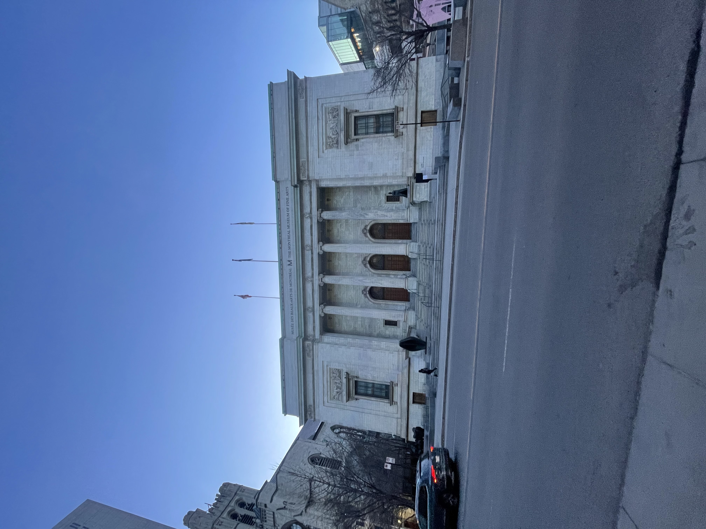
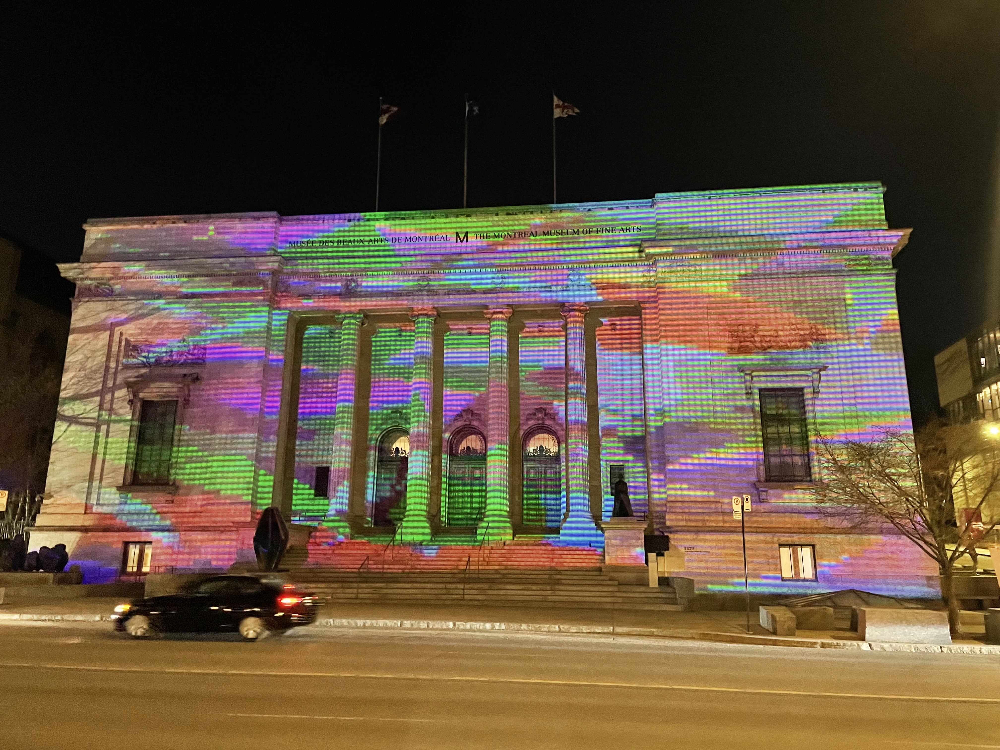
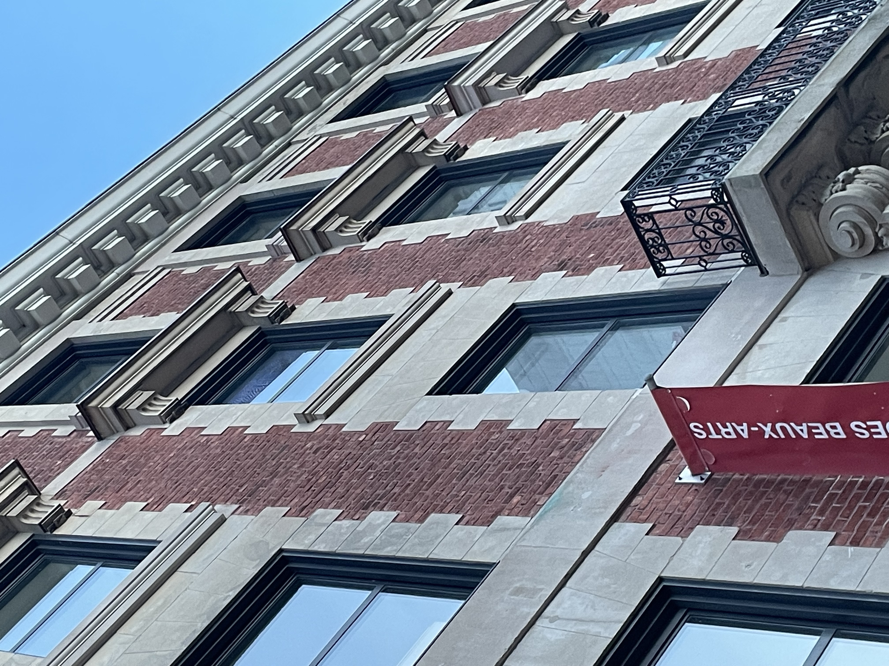
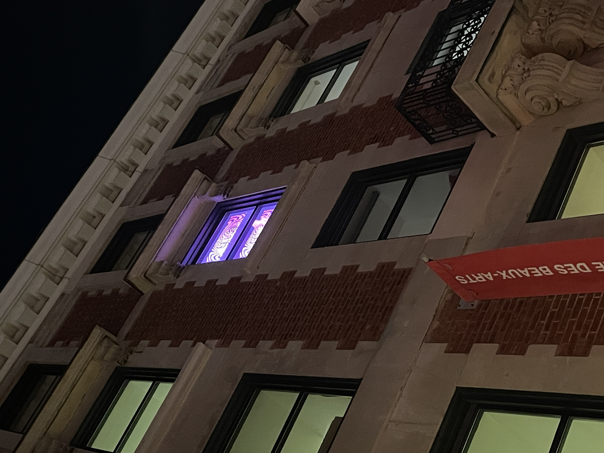

# Visite individuelle

## Introduction
Pixels, petits points et monument presentée par Nathalie Bujold, née en Gaspésie, elle vit et travaille à Montréal. Du 11 septembre 2023 au 31 mars 2024, cette oeuvre temporaire illumine tous les soirs jusqu’à 23h la façade du pavillon Michal et Renata Hornstein du MBAM. J'ai visité l'exposition le 30 mars 2024 en apres midi juste avant la tombée du jour pour voir la facade du Musée des beaux-arts avant la projection durant le soir.

## Description de l'oeuvre
À la bordure de l’artisanat et de l’art numérique, Pixels, petits points et monument plonge les passants et passantes de la rue Sherbrooke Ouest. À l'aide d'un projecteur synthétiseur vidéo, Bujold peut créer des paysages imaginatifs et des structures monumentales tel que le Musée des beaux-arts. 

### Voici l'oeuvre durant le jour

### Voici l'oeuvre durant le soir

Le positionement de ce projecteur ce situe dans une chambre en face du monument a un angle ou elle peut couvrire tout le musée. Le projecteur est interpreter comme une fenetre pour donner l'impression que c'est simplement une fenetre normal. Pourquoi c'est interprété pour une fenêtre et non un simple projecteur dans une chambre. La raison est les rayonements des projecteurs seront moins claires si elles frappent la fenêtre avant la facade du musée et elle couvreront surement pas toute le mur.

### Voici la chambre du projecteur durant le jour

### Voici la chambre du projecteur durant le nuit

## Type d'instalation
Cette installation peut prendre différentes formes selon le lieu et le contexte, la projection interactive est sur le mur du MBAM. Les pixels et les points sont souvent utilisés pour représenter des monuments symbolique ou des paysages urbains, ajoutant une dimension supplémentaire à l'œuvre.

## Composantes et techniques
On a pas acces a l'interieur de la chambre donc je ne peut pas trop expliquer de ce qu'elle compose vu que la majoriter des composantes techniques sont a l'interieur de celle-si. Néanmoins, l'exposition est simple vue que c'est juste une projection a partir d'une chambre vers la facade du MBAM. 

#### Voici ce que j'ai observer durant ma visite.

- Projection et mapping vidéo

- Pixels et points

- Éclairage

## Éléments nécessaires à la mise en exposition
De ce que j'ai cite dans le paragraph de composantes et techniques, celles-si sont des éléments crucial à la mise en exposition. 

Premierement, Bujold utilise la technique de projection vidéo et de mapping pour animer ses créations. Cela permet de donner du mouvement et de la dynamique à l'œuvre.

Deuxiemement, les éléments essentiel de l'œuvre sont les pixels et les petits points, elles servent a créer des formes, des textures et des détails.

Troisiemement,  L'éclairage joue un rôle important, car l'éclairage peut créer des jeux d'ombre et de lumière, qui met l'accent sur les formes et les contours des pixels et des points.

Bref, la combinaison de ces trois éléments donne une experience fasinente au visiteure qui ce promene sur la rue lors de la tombe du jour.

## Experience vécue

## Aspect que vous ne souhaiteriez pas retenir
